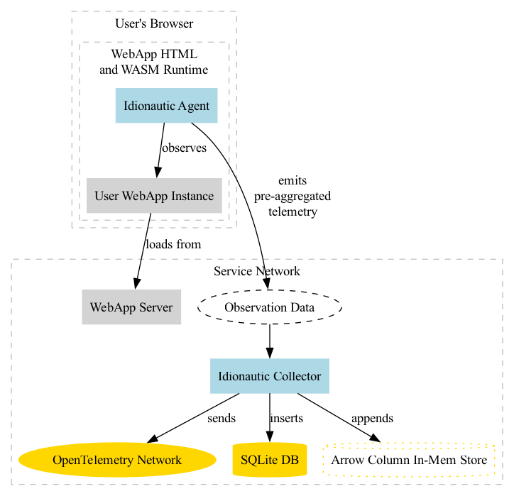

An experiment in APM and observability.
===========

UNDER CONSTRUCTION
=============

This repository creates a WebAssembly / Rust agent that is loaded into a client
application via script tags.  The agent will watch the other js activity and
report counter and timer observations of how the user is interacting with the
app and the performance of the app components and APIs.

Three Main Features:

* no code changes - the application code being instrumented is unchanged by the
  introduction of this agent
* network efficient - pre-aggregated store-and-forwarding of data by the agent instance
* high-cardinality keys are allowed - observabilty requires high-level metrics
  to be able to be drilled into down to the user and transaction level

Initially data is logged to a custom service that logs data to an embedded
sqlite DB.

Eventually, the server will support forwarding to OpenTelemetry gateways as well
as an experimental wide-record analytics store designed to support columnar
storage tolerant of high-cardinality values in support of observability.



```bash
wasm-pack build --target web
# or better yet
make
```

See https://github.com/navicore/idionautic-server for the backend to the
observation collection this agent performs.

See https://github.com/navicore/idionautic-demo for a UI lab where the agent's
ability to watch tags and events inside a webapp are demonstrated and debugged.

Next Steps
-----------
* make the demo app render working tabs and buttons and checkboxes
* make the demo app render output of API GET calls from the server
* design spike for agent
  * should phone home a configured freq with payloads
  * should phone home a configured freq regardless of payloads
  * should use response from server interaction to adjust frequency of the two
    above calls
  * what kinds of events can js monitor?
  * what events should agent monitor?
  * is the agent fully reactive or must it inspect, ie: is there a win3.1-like
    loop?
